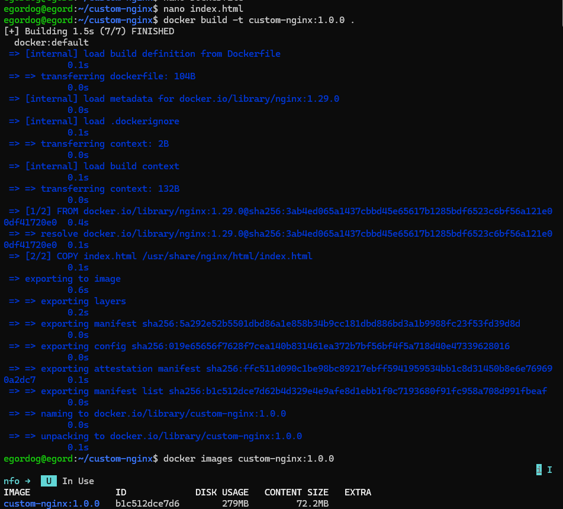
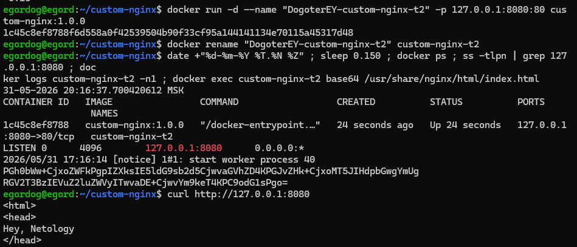
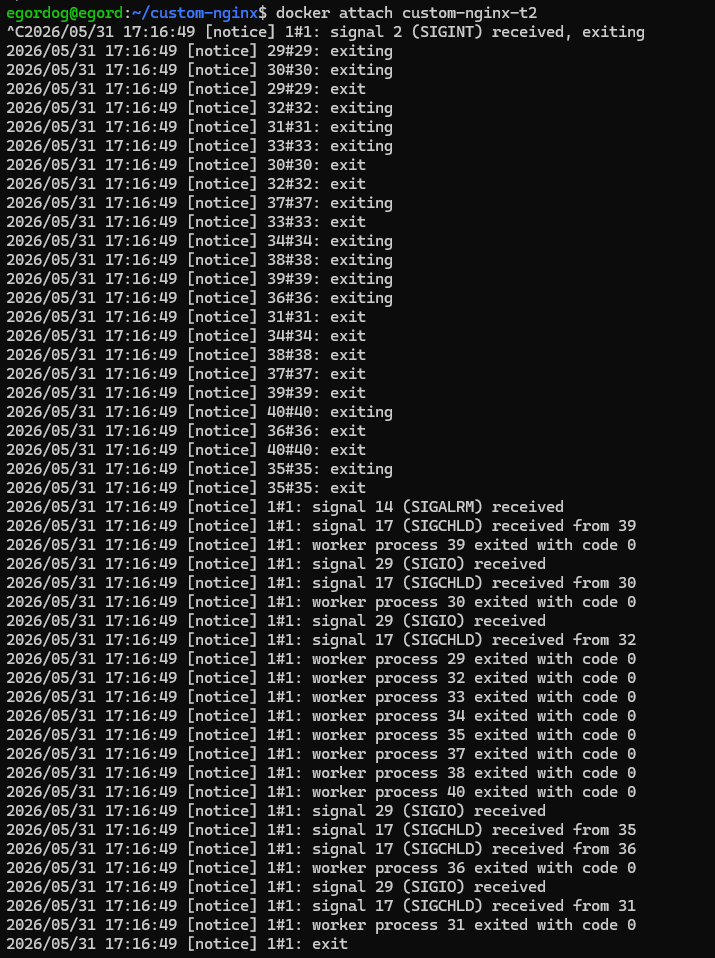
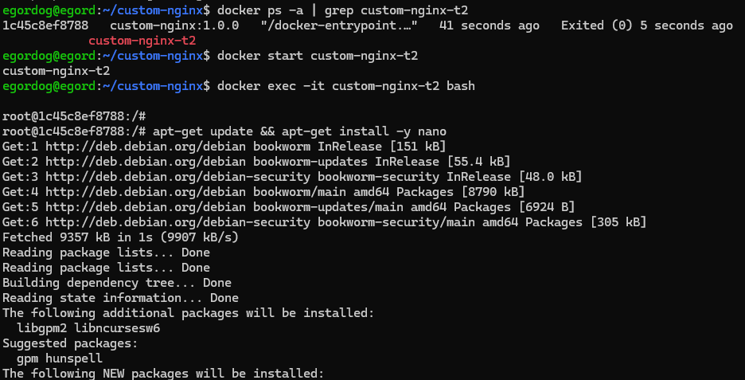
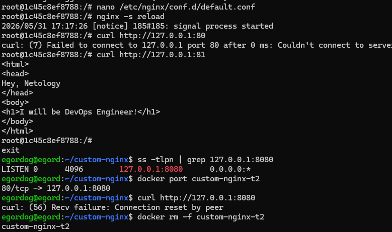
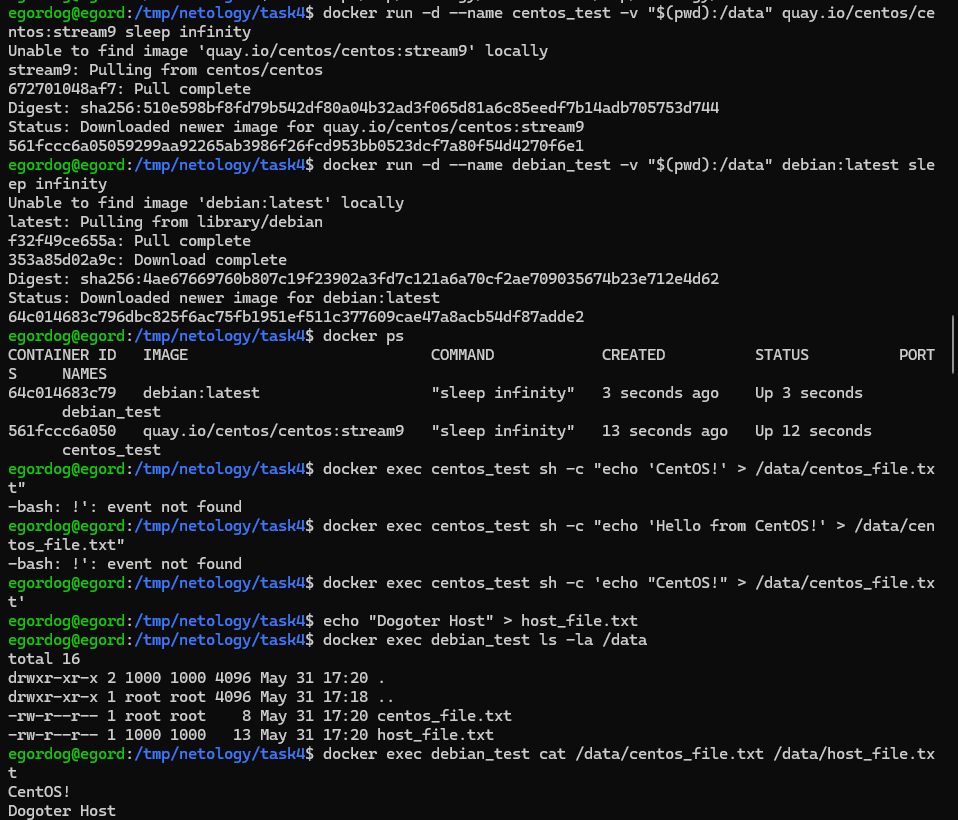
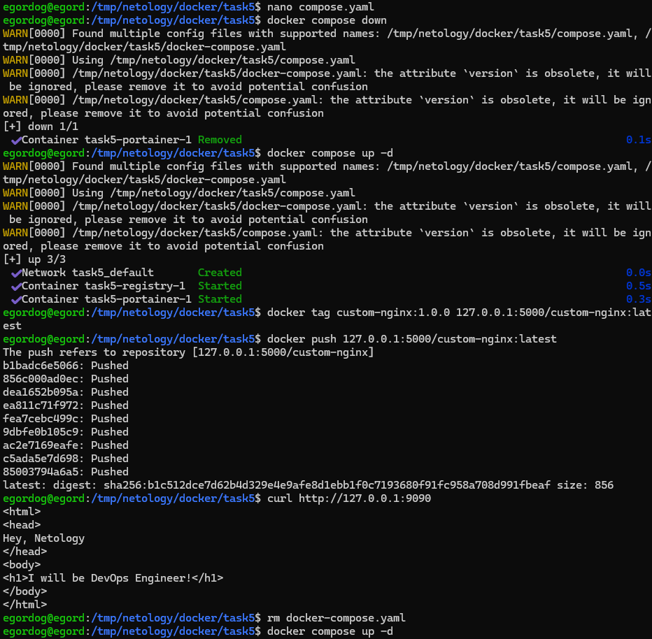
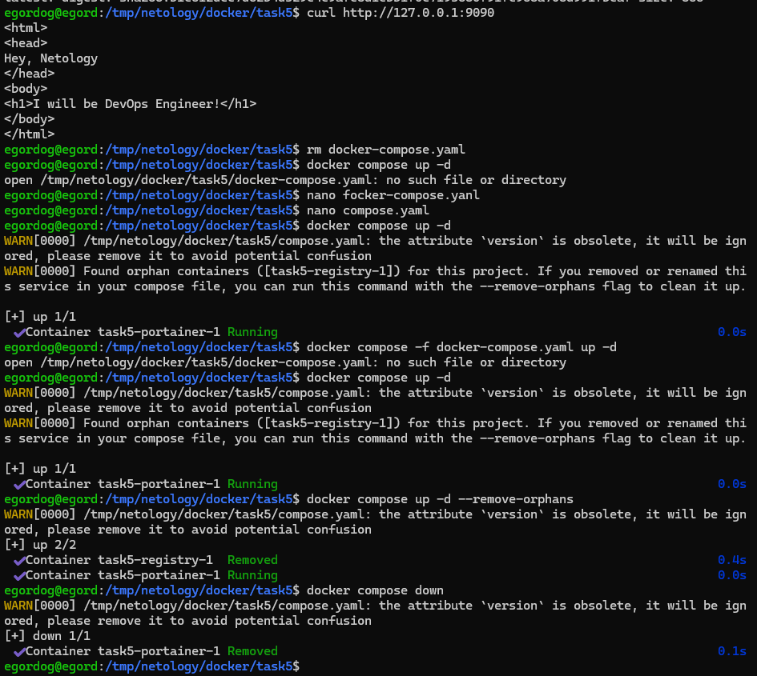
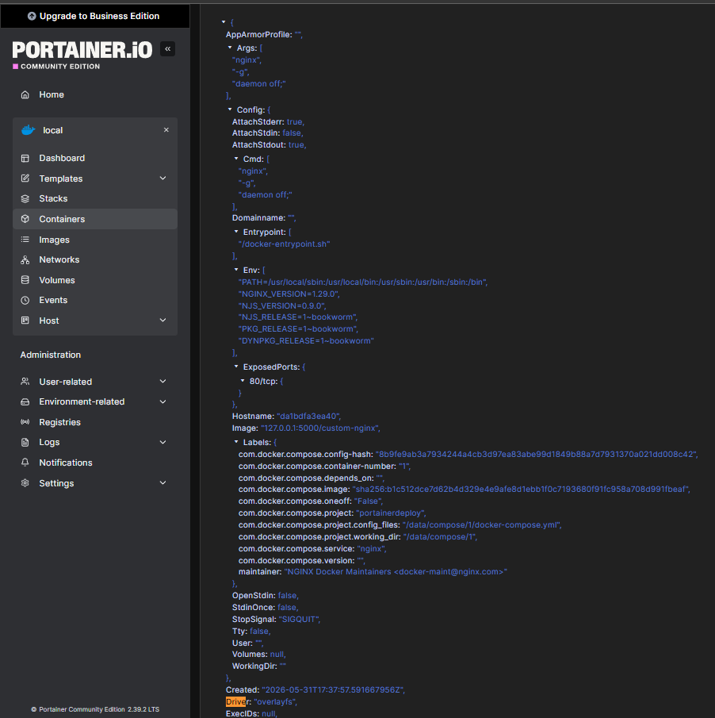

# devops-netology-dogoter

# Домашнее задание к занятию «Оркестрация группой Docker контейнеров на примере Docker Compose»

## Задание 1.

### Создал кастомный образ

## Задание 2.

## Задание 3.

### Контейнер останавливается по аналогии с kill в linux комбинация ctr + c отправляет сигнал который останавливает контейнер

### Это дополнительное, необязательное задание. Попробуйте самостоятельно исправить конфигурацию контейнера, используя доступные источники в интернете. Не изменяйте конфигурацию nginx и не удаляйте контейнер. Останавливать контейнер можно.

### По-умолчанию docker пробрасывает 8080 на 80 порт, а мы переназначили только nginx

#### Можно сделать настроить hosts или iptables для подмены портов на сетевом уровне, однако используя какие-либо команды найти информацию не смог

## Задание 4.

## Задание 5.

`И выполните команду "docker compose up -d". Какой из файлов был запущен и почему?`

### Из-за иерархие при выборе конфигурационного файла для запуска

