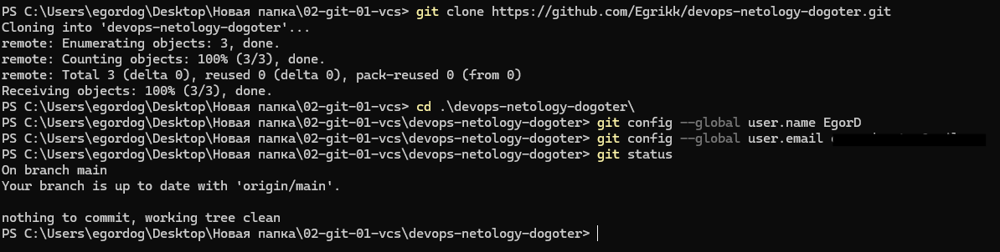

# devops-netology-dogoter

# Домашнее задание к занятию «Системы контроля версий»

## Задание 1. Создать и настроить репозиторий для дальнейшей работы на курсе

## В файле README.md опишите своими словами, какие файлы будут проигнорированы в будущем благодаря добавленному .gitignore.

1. Будут игнорировать все файлы в директории .terraform
2. Будут игнорировать все файлы оканчивающиеся на .tfstate и содержащие .tfstate.
3. Будут игнорировать все файл crash.log и (начинающиемя на crash. и заканчивающиеся на .log) <- один файл
4. Будут игнорировать все файлы оканчивающиеся на .tfvars или .tfvars.json
6. Будут игнорировать все файлы override.tf, override.tf.json и оканчивающиеся на _override.tf и _override.tf.json
7. Будут игнорировать все файлы .terraform.tfstate.lock.info
8. Будут игнорировать все файлы .terraformrc и terraform.rc
