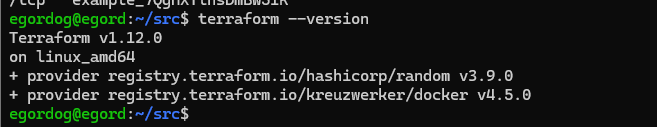
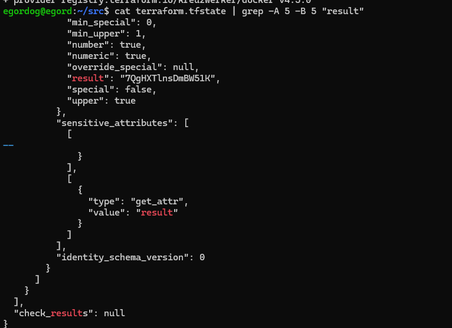
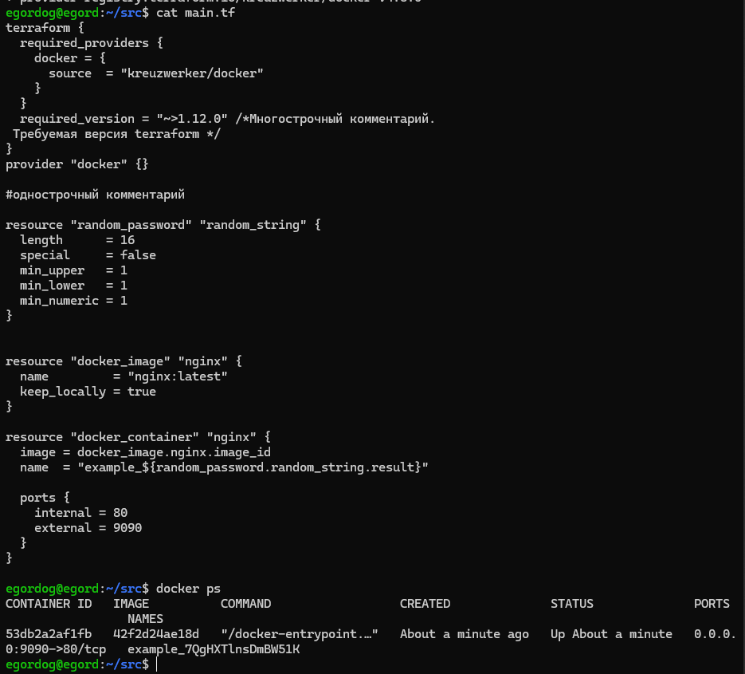
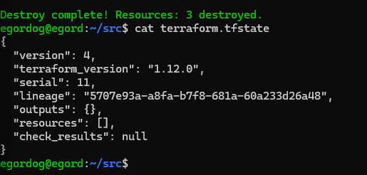

# devops-netology-dogoter

# Домашнее задание к занятию «Введение в Terraform»

## Задание 1.1

### Terraform --vesion



## Задание 1.2

### В файле .gitignore указана строка: personal.auto.tfvars c #own secret vars store.

## Задание 1.3

### Файл хранит содержимое random_password



## Задание 1.4
1. В строке resource "docker_image" пропущено имя типа ресурса
2. random_password.random_string_FAKE.resulT не существует такого параметра правильно random_password.random_string.result
3. 1nginx а не nginx

## Задание 1.5



## Задание 1.6

### Опасность в том что можно удалить ресурс без подстверждения, а необоходим для автоматизации когда нет возожности вручную нажать подтверждение.



## Задание 1.8
```
keep_locally = true
```
### keep_locally (Boolean) If true, then the Docker image won't be deleted on destroy operation. If this is false, it will delete the image from the docker local storage on destroy operation.
