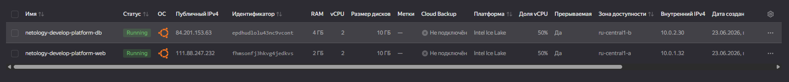
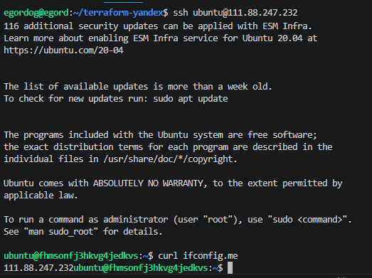
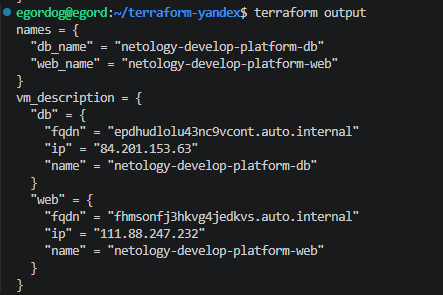

# Домашнее задание к занятию «Основы Terraform. Yandex Cloud»

## Задание 1

### Задание 1.4

1. platform_id = "standart-v4" - такой платформы не существует и правильное написание standard, на данным момент платформ 3: v1,v2,v3
2. service_account_key_file = file("~/.authorized_key.json") - file не нужен

### Задание 1.5

### Задание 1.6 

В процессе обучения данные параметры позволяют соэкономить за счет прерываний (preemptible = true) и доли мощности ядра (core_fraction=5) в параметрах ВМ для экономии облачных ресурсов

## Задание 4

## Задание 6

[Перейти в папку с кодом](ter-homeworks-hw-02/src/)
