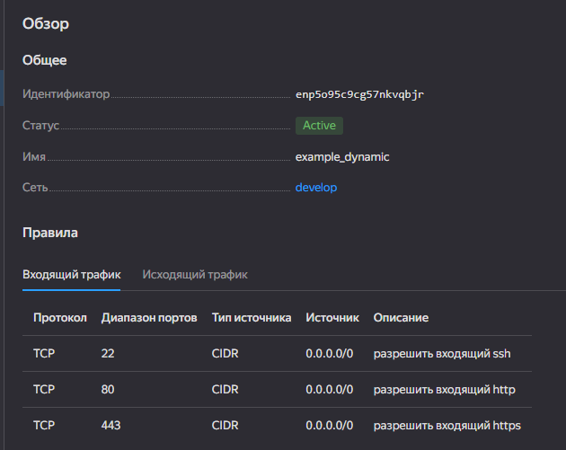
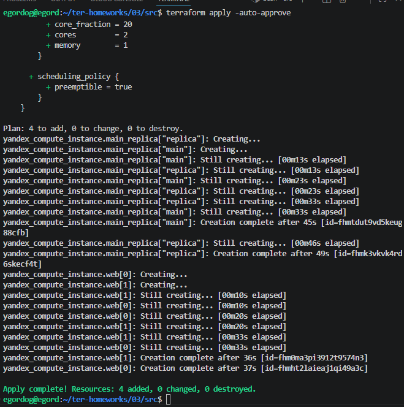
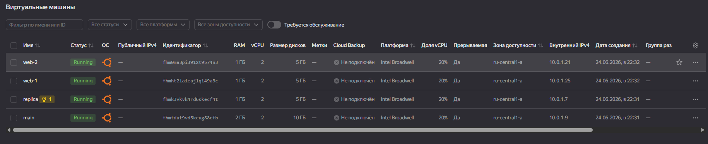
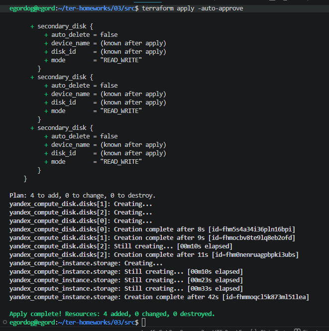
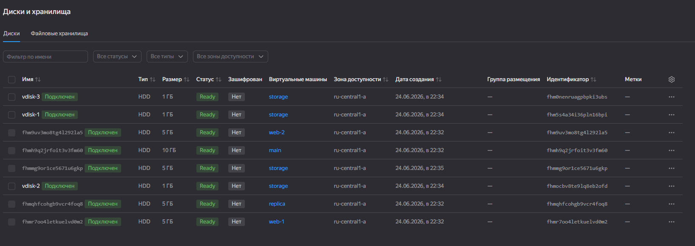
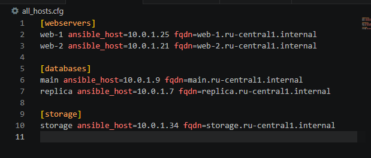

## Домашнее задание к занятию «Управляющие конструкции в коде Terraform»

[Папка с кодом](ter-homeworks-hw-03/)

### Задание 1




### Задание 2

[count-vm.tf](ter-homeworks-hw-03/count-vm.tf)
[for_each-vm.tf](ter-homeworks-hw-03/for_each-vm.tf)





### Задание 3

[disk_vm.tf](ter-homeworks-hw-03/disk_vm.tf)





### Задание 4
```
P.S. указал локальные ip так как по неведомой причине yandex отказался выдавать мне глобальные
```
